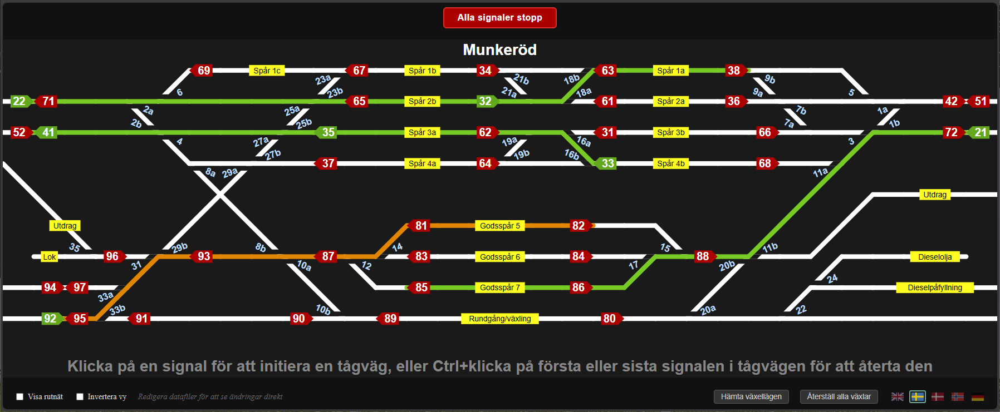

# Yard Control Application

A .NET Blazor Server application for controlling model train yard points (turnouts) via LocoNet protocol.
It provides a graphical web UI with interactive signal-based train route setting, as well as numeric keypad input for hands-free operation.

The application supports individual point control, predefined train routes between signals, point locking to prevent conflicting movements, and real-time position feedback from LocoNet.



## Usage

### Web Interface

The browser-based GUI displays the full yard topology as an interactive SVG diagram:

- **Signals** are shown as red (stop) or green (go) indicators with direction arrows.
- **Points** display their current position with colour coding (straight/diverging/unknown).
- **Active train routes** are highlighted in green along the track path.
- **Labels** identify tracks, signals, and points.

To set a train route, click a signal to select the *from* signal, then click a second signal to select the *to* signal. The route is set and the involved points are moved and locked. CTRL+click on a green signal to cancel its route.

The footer provides:
- **Show Grid** checkbox to toggle coordinate grid overlay (useful for editing topology files).
- **Query Point States** button to request current positions from hardware (or simulate random positions in development mode).
- **Reset All Points** button to set all points to straight position.
- **Language selector** to switch the UI language.

### Numpad Commands

All operations can be performed from a numeric keypad, which is useful for wireless hands-free control.

#### Point Commands

| Command | Description |
|---------|-------------|
| `[number]+` | Set point to straight (e.g., `1+`) |
| `[number]-` | Set point to diverging (e.g., `1-`) |

A point number can represent a single point or multiple coupled points (e.g., opposing crossover points) that move together.

#### Train Route Commands

| Command | Description |
|---------|-------------|
| `[from][to]⏎` | Set main train route (e.g., `2131⏎` sets path from signal 21 to 31) |
| `[from][to]*` | Set shunting route |
| `[from][to]/` | Clear train route (e.g., `2131/`) |
| `[from].[to]⏎` | When signal numbers have different digit counts, use `.` as divider (e.g., `121.33⏎`) |
| `[from].[via].[to]⏎` | Multi-signal route (e.g., `21.31.35⏎`) |
| `[signal]/` | Clear all routes up to a signal (e.g., `31/`) |
| `//` | Cancel all train routes and clear all locks |

**Note:** Clearing up to a signal can be used to manually confirm that a train has reached its destination signal, releasing the locks on points used in the route. This is useful when occupancy detection is not available.

#### Turntable Commands

| Command | Description |
|---------|-------------|
| `+[track number]⏎` | Move turntable to the specified track position |

#### Other

| Command | Description |
|---------|-------------|
| `⌫` | Clear current input buffer |
| `+` `-` | Reload configuration |

## LocoNet Communication

### Setting Points

Point commands are sent as LocoNet turnout (accessory) commands. Each point number maps to one or more LocoNet addresses configured in `Points.txt`. A negative address inverts the direction: `Closed` becomes `Thrown` and vice versa.

When a train route is set, the application sends commands for all points in the route in sequence.

### Point Locking

When `LockOffset` is configured, hardware point locking is supported. Setting a train route:

1. Sends turnout commands to move points to the correct positions.
2. Sends lock commands (`Closed`) to each point's lock address (*address + offset*).

When a train route is cleared:

1. Sends unlock commands (`Thrown`) to the lock addresses.

This feature is designed for **Möllehem** switch decoders that support individual point locks via a parallel address range. When a point is locked, it cannot be altered via LocoNet, XpressNet, or buttons connected to the decoder.

Logical locking is always active regardless of hardware support: the application prevents conflicting train routes from being set when the same point would need different positions.

### Position Feedback

The application listens for LocoNet switch report messages to track the actual position of each point. When a switch report is received, the LocoNet address is mapped back to the corresponding point number and the position is updated in real-time on the UI.

This means that point changes made from other sources (e.g., ROCO Z21 app, other throttles) are reflected in the yard display.

For paired points with sub-point suffixes (e.g., `1a`, `1b`), each sub-point tracks its position independently from the same or different LocoNet addresses.

## Configuration

Configuration files are located in `YardController.Web/Data/` (paths can be changed in `appsettings.json`). Files are watched for changes and automatically reloaded.

### Points (Points.txt)

Maps point numbers to LocoNet addresses.

**Basic format:** `number:address1,address2,...`

```
1:840
3:842
7:835,-836
```

- A point number can have multiple addresses if it controls multiple turnouts.
- Negative addresses flip direction: `Thrown` becomes `Closed` and vice versa.

**Sub-point suffixes:** Append a letter to an address to track sub-points independently.

```
1:840a,843b
```

This maps address 840 to sub-point `1a` and address 843 to sub-point `1b`. Each sub-point displays its own position feedback in the UI, which is important for crossovers where external applications can move each motor independently.

**Grouped format:** Different addresses for straight vs diverging positions.

```
23:(823,820)+(823,-816,820)-
```

The `(...)` before `+` lists straight addresses, and `(...)` before `-` lists diverging addresses. Addresses can also have sub-point suffixes in grouped format.

**Lock offset:** Enables hardware locking for subsequent point definitions.

```
LockOffset:1000
```

Points defined after this line will use *address + 1000* as their lock address.

**Address range:** Creates points where the number equals the address.

```
Adresses:800-853
```

This is useful for verifying individual switches during initial setup.

**Turntable:**

```
Turntable:1-17;196
```

Creates turntable tracks 1-17 with addresses 197-213 (track number + offset). The turntable command is always `Closed`.

### Train Routes (TrainRoutes.txt)

Defines paths between signals with required point positions.

**Basic format:** `from-to:point1±,point2±,...`

```
21-31:1+,3+,7+
35-41:x25+,27+,4+,2+
```

- `from-to` are signal numbers.
- `+` means straight, `-` means diverging.
- `x` prefix marks flank protection points (locked but not on the active path).

**Composite format:** Builds longer routes from shorter ones.

```
21-35:21.31.35
```

This combines routes 21-31 and 31-35. Referenced routes must be defined earlier in the file.

Comments start with a single quote (`'`).

### Topology (Topology.txt)

Defines the yard layout as a track diagram. The first line is the station name, followed by `[Tracks]` and `[Features]` sections. See `CLAUDE.md` for the full syntax reference.

## Translations

The application UI is localised in English, Swedish, Danish, Norwegian, and German using standard .NET resource files.

Track labels in the yard diagram (e.g., "Goods track", "Headshunt") can be translated per language using a CSV file (`Data/LabelTranslations.csv`):

```
en;da;de;nb;sv
Track;Spor;Gleis;Spor;Spår
Goods track;Godsspor;Güterspur;Godsspor;Godsspår
Headshunt;Træktilbagespor;Ausziehgleis;Uttrekksspor;Utdrag
Munkeröd;Munkerød;Munkeröd;Munkerød;Munkeröd
```

The station name is also translated through this file.

## Signals

Setting a train route should also control the signals along the route. The basic stop/go will be supported in the application. However, detailed signal aspects is typically implemented in the yard's internal control system and is not part of this application.

## Occupation feedback

The intention is that when Munkeröd get *occupation feedback* this will also be notified, so that green train routes becomes red when it is occupiend.
The train route will also automatically reset when the train reaches the final signal. 

## Building and Running

```bash
# Build
dotnet build "Yard Control Application.slnx"

# Run
dotnet run --project YardController.Web/YardController.Web.csproj

# Test
dotnet test
```

The application requires .NET 10.0. In development mode, a simulated controller is used so no LocoNet hardware is needed.
