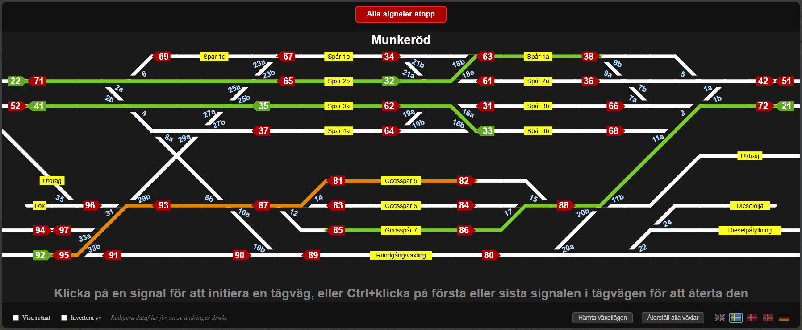

# Yard Control Application

A .NET Blazor Server application for controlling model train yard points (turnouts) via LocoNet protocol.
It provides a graphical web UI with interactive signal-based train route setting, as well as numeric keypad input for hands-free operation.

The application supports individual point control, train routes between signals with automatic route derivation from topology, point locking to prevent conflicting movements, signal control, and real-time position feedback from LocoNet.

### Operations
- **Main and shunting routes** — Set main train routes or shunting routes between signals. Main routes are highlighted in green; shunting routes in orange. Shunting routes use dwarf signals, skip destination signal go-aspects, and release locks immediately — matching real railway shunting operations.
- **Automatic route derivation** — Just specify the from and to signals; the application finds the shortest path through the topology and determines the required point positions automatically.
- **Signal control** — Signals are set to go/stop automatically when routes are set or cleared, with hardware integration via LocoNet accessory addresses. Five signal types are supported: OutboundMain, InboundMain, MainDwarf, ShuntingDwarf, and Hidden.
- **Train route queueing** — When a route conflicts with an active route, it is automatically queued and executed as soon as the blocking route is cleared. Queued routes are displayed in the UI and can be cancelled before they execute.
- **Clear vs cancel semantics** — Clearing a route (`/`) keeps train numbers and releases locks after a safety delay; cancelling (`ESC`) removes train numbers and releases locks immediately. This distinction mirrors real dispatch operations.
- **Train number labels** — Assign train numbers to signals and see them displayed live on the yard diagram. Numbers follow the train automatically as routes are set, and can be assigned via numpad commands. Blue labels next to each signal provide at-a-glance train identification.

### Configuration and options
- **Unified station configuration** — Define your entire station (topology, points, signals, routes, translations) in a single text file with a human-readable format.
- **Multiple station support** — Configure several stations and switch between them at runtime from the UI.
- **Live configuration reload** — Edit data files while the application is running; changes are detected and applied automatically.
- **Localisation** — UI and track labels available in English, Swedish, Danish, Norwegian, and German.



## Installation

### Download a release

Download the archive for your platform from the [GitHub Releases](https://github.com/tellurianinteractive/Tellurian.Trains.YardControl.Application/releases) page:

| Platform | Archive |
|----------|---------|
| Windows x64 | `YardControlApplication-vX.X.X-win-x64.zip` |
| Windows ARM64 | `YardControlApplication-vX.X.X-win-arm64.zip` |
| Linux x64 | `YardControlApplication-vX.X.X-linux-x64.tar.gz` |
| Linux ARM 32-bit | `YardControlApplication-vX.X.X-linux-arm.tar.gz` |
| Linux ARM 64-bit | `YardControlApplication-vX.X.X-linux-arm64.tar.gz` |

The releases are self-contained — no .NET runtime installation is required.

### Install and run

**Windows:**

1. Extract the zip archive to a folder of your choice (e.g., `C:\YardControl`).
2. Connect your LocoNet interface via USB.
3. Edit `appsettings.json` to configure your stations and serial port:
   ```json
   {
     "Stations": [
       { "Name": "Munkeröd", "DataFolder": "Data\\Munkeröd.txt" }
     ],
     "SerialPort": {
       "PortName": "COM5",
       "BaudRate": 57600
     }
   }
   ```
4. Run `YardController.Web.exe`.
5. Open the displayed URL (typically `http://localhost:5000`) in a browser.

**Linux:**

1. Extract the archive:
   ```bash
   tar -xzf YardControlApplication-vX.X.X-linux-x64.tar.gz -C /opt/yardcontrol
   ```
2. Make the executable runnable:
   ```bash
   chmod +x /opt/yardcontrol/YardController.Web
   ```
3. Connect your LocoNet interface via USB.
4. Edit `appsettings.json` to configure your stations and serial port:
   ```json
   {
     "Stations": [
       { "Name": "Munkeröd", "DataFolder": "Data/Munkeröd.txt" }
     ],
     "SerialPort": {
       "PortName": "/dev/ttyUSB0",
       "BaudRate": 57600
     }
   }
   ```
   The serial port is typically `/dev/ttyUSB0` for USB-to-serial adapters or `/dev/ttyACM0` for devices with built-in USB. Run `ls /dev/tty*` to find the correct device name.
5. Run the application:
   ```bash
   /opt/yardcontrol/YardController.Web
   ```
6. Open the displayed URL (typically `http://localhost:5000`) in a browser.

### Station data files

Copy your station `.txt` files into the `Data` folder next to the executable and reference them in `appsettings.json`. See the [Configuration](#configuration) section for the file format. The application watches the data files for changes, so you can edit them while the application is running.

## Usage

### Web Interface

The browser-based GUI displays the full yard topology as an interactive SVG diagram:

- **Signals** are shown as red (stop) or green (go) indicators with direction arrows.
- **Points** display their current position with colour coding (straight/diverging/unknown).
- **Active main routes** are highlighted in green along the track path; **shunting routes** in orange; routes being cancelled are shown in blue (locks still held).
- **Train number labels** appear as blue boxes next to signals, showing which train is at each location.
- **Labels** identify tracks, signals, and points.

To set a train route, click a signal to select the *from* signal, then click a second signal to select the *to* signal. The route is set, the involved points are moved and locked, and the from signal turns green (go). CTRL+click on a green signal to cancel its route. Shift+click on any signal to toggle it between stop and go manually.

Above the yard diagram is an **All Signals Stop** emergency button that immediately sets all green signals to red.

The footer provides:
- **Show Grid** checkbox to toggle coordinate grid overlay (useful for editing topology files).
- **Query Point States** button to request current positions from hardware (or simulate random positions in development mode).
- **Reset All Points** button to set all unlocked points to straight position (locked points are skipped).
- **Language selector** to switch the UI language.

### Numeric Keypad

A numeric keypad is required for full operation — it enables hands-free control of all yard functions. Either a wired USB keypad or a wireless keypad works; a wireless keypad is notably easier to move around with during operations.

#### Point Commands

| Command | Description |
|---------|-------------|
| `[number]+` | Set point to straight (e.g., `1+`) |
| `[number]-` | Set point to diverging (e.g., `1-`) |

A point number can represent a single point or multiple coupled points (e.g., opposing crossover points) that move together.

#### Train Route Commands

| Command | Description |
|---------|-------------|
| `[from][to]⏎` | Set main train route (e.g., `2131⏎` sets path from signal 21 to 31) |
| `[from][to]*` | Set shunting route |
| `[from][to]/` | Clear train route, keeping train numbers (e.g., `2131/`) |
| `[from][to]ESC` | Cancel train route and remove train numbers |
| `[from].[to]⏎` | When signal numbers have different digit counts, use `.` as divider (e.g., `121.33⏎`) |
| `[from].[via].[to]⏎` | Multi-signal route (e.g., `21.31.35⏎`) |
| `[signal]/` | Clear all routes up to a signal (e.g., `31/`) |
| `//` | Clear all train routes and release all locks (keeps train numbers, except at outbound signals) |
| `ESC ESC` | Cancel all train routes, release all locks, and remove all train numbers |
| `**` | Set all signals to stop |
| `==` | Set all unlocked points to straight |

**Note:** Clearing up to a signal can be used to manually confirm that a train has reached its destination signal, releasing the locks on points used in the route. This is useful when occupancy detection is not available.

#### Train Number Commands

Train numbers can be assigned to signals when setting a route by adding `=[trainNumber]` before the route terminator.

| Command | Description |
|---------|-------------|
| `[from][to]=[trainNumber]⏎` | Set route and assign train number to destination signal (e.g., `2131=1234⏎`) |
| `[from].[to]=[trainNumber]⏎` | Same with `.` divider (e.g., `121.33=1234⏎`) |

When a route is set, any existing train number at the from signal is automatically moved to the destination signal. An explicit train number in the command takes precedence over a moved number. Cancelling a route with `ESC` removes train numbers from both signals; clearing with `/` keeps them.

#### Turntable Commands

| Command | Description |
|---------|-------------|
| `+[track number]⏎` | Move turntable to the specified track position |

#### Other

| Command | Description |
|---------|-------------|
| `⌫` | Clear current input buffer |
| `+-` | Reload configuration |

## Configuration

Configuration files are located in `YardController.Web/Data/` (paths can be changed in `appsettings.json`). Files are watched for changes and automatically reloaded.

Multiple stations can be configured in `appsettings.json`:

```json
{
  "Stations": [
    { "Name": "Munkeröd", "DataFolder": "Data\\Munkeröd.txt" },
    { "Name": "Steinsnes", "DataFolder": "Data\\Steinsnes.txt" }
  ]
}
```

Each station is configured as a single text file with named sections. This keeps all station data together and enables automatic route derivation.

```
Munkeröd

[Settings]
LockOffset:1000
LockReleaseDelay:30

[Tracks]
1.1-1.2-1.3-1.4                         ' track segments (left-to-right)

[Points]
2.3(1a>)-2.4  @840a,843b                ' forward point with LocoNet address
2.5(<2)-2.6  @842                        ' backward point

[Signals]
1.1:21>:u  @900                          ' outbound main signal driving right
1.4:<31:i  @901;951                      ' inbound main signal with feedback address

[Routes]
21-31                                    ' auto-derived from topology
21-31:x25+                               ' auto-derived + explicit flank protection
21-35:21.31.35                           ' composite route via intermediate signal

[Labels]
1.1[Goods track]1.4

[Gaps]
2.3|2.4                                  ' occupancy gap on a link

[Translations]
en;sv;da;nb;de
Track;Spår;Spor;Spor;Gleis
Goods track;Godsspår;Godsspor;Godsspor;Güterspur

[Turntable]
Tracks:1-17
Offset:196
```

Comments start with a single quote (`'`). Section names are case-insensitive.

**Route auto-derivation:** When a route line contains only signal numbers (e.g., `21-31` without a colon), the application uses the topology graph to find the shortest path between the signals and automatically determines which points need to be set to straight or diverging. You can also specify only flank protection points (prefixed with `x`) and let the on-route points be auto-derived.

**Signal types:** `u`=OutboundMain, `i`=InboundMain, `h`=MainDwarf, `d`=ShuntingDwarf, `x`=Hidden.

## Translations

The application UI is currently localised in English, Swedish, Danish, Norwegian, and German.

Track labels in the yard diagram (e.g., "Goods track", "Headshunt") can be translated per language. Translations are defined in the `[Translations]` section of the station file.

## Signals

When a train route is set, the from signal and any intermediate signals are set to go (green). When a route is cleared, those signals are set back to stop (red), unless they are still needed by another active route.

The `//` command (cancel all routes) also sets all route signals to stop before releasing locks. The `**` command sets all signals to stop regardless of route state.

Detailed signal aspects are typically implemented in the yard's internal control system and are not part of this application.

## Occupation Feedback

The intention is that when a station gets *occupation feedback*, this will also be reflected in the UI, so that green train routes become red when occupied.
The train route will also automatically reset when the train reaches the final signal.

## LocoNet Communication

### Setting Points

Point commands are sent as LocoNet turnout (accessory) commands. Each point number maps to one or more LocoNet addresses configured in `Points.txt`. A negative address inverts the direction: `Closed` becomes `Thrown` and vice versa.

When a train route is set, the application sends commands for all points in the route in sequence.

### Point Locking

When `LockOffset` is configured, hardware point locking is supported. Setting a train route:

1. Sends turnout commands to move points to the correct positions.
2. Sends lock commands (`Closed`) to each point's lock address (*address + offset*).

When a train route is cleared:

1. Signals are immediately set to stop.
2. The route is shown in blue on the UI, indicating that locks are still held.
3. After a configurable delay, unlock commands (`Thrown`) are sent to the lock addresses and the route is fully cleared.

This two-phase cancellation mirrors real railway operations where point locks are held for a safety period after signal clearance. The delay is configured in `TrainRoutes.txt` (see below). In development mode, the delay is always 5 seconds.

This feature is designed for **Möllehem** switch decoders that support individual point locks via a parallel address range. When a point is locked, it cannot be altered via LocoNet, XpressNet, or buttons connected to the decoder.

Logical locking is always active regardless of hardware support: the application prevents conflicting train routes from being set when the same point would need different positions.

### Position Feedback

The application listens for LocoNet switch report messages to track the actual position of each point. When a switch report is received, the LocoNet address is mapped back to the corresponding point number and the position is updated in real-time on the UI.

This means that point changes made from other sources (e.g., ROCO Z21 app, other throttles) are reflected in the yard display.

For paired points with sub-point suffixes (e.g., `1a`, `1b`), each sub-point tracks its position independently from the same or different LocoNet addresses.
